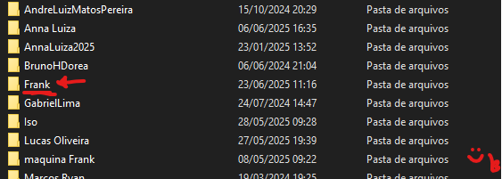
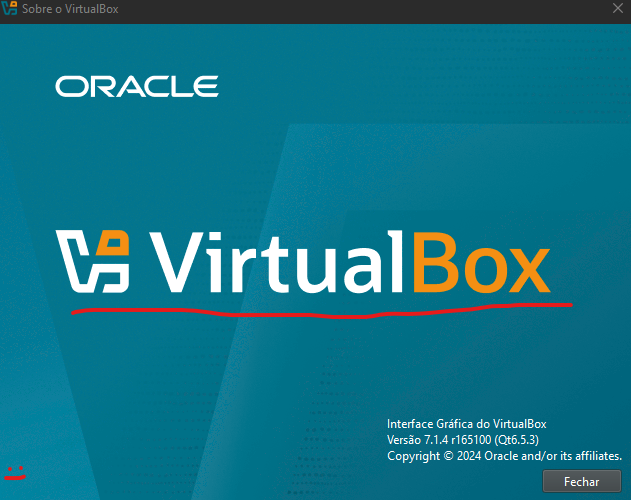
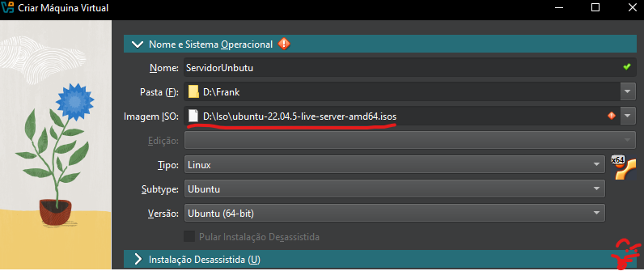
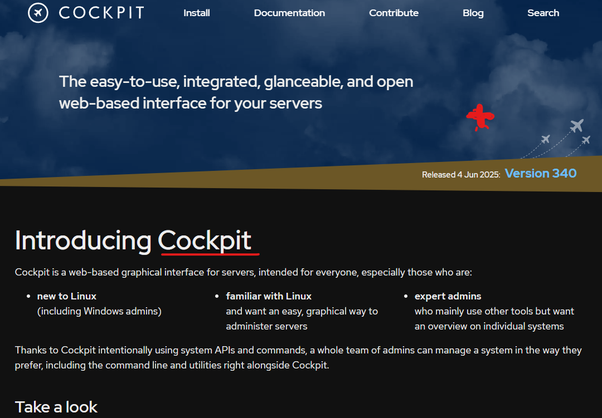

# preparação de ambiente
criar uma maquina virtual para instalar as ferramentas e dependencias para o estudo de algoritimos e logica de programação 

## criar o diretorio base 
vamos criar um diretorio base para guardar a nossamaquina virtual, será criado no drive (D) com o nome Frank (quem escreveu neste caso)


## preparação da maquina virtual
### vamos usar a ferramenta de virtualização chamada virtual box

<a href="https://www.virtualbox.org/wiki/Downloads"> Click aqui para download

## criando o servidor

voce irá colocar as especificações como 
2 processadores (core)
memoria de 4096
disco de 100gb 
memoria de video 128
e a iso do Ubuntu 24.04


## fazendo o server ubuntu 

Apos voce colocar as especificações e criar a maquina virtual voce irá fazer os comandos:

``` shell
- sudo apt update -y
```

``` shell
- sudo apt upgrade -y
```

``` shell
- reboot
```

``` shell
- sudo apt install cockpit
```
## o que é o cock pit e por que vamos instalar ele?



O Cockpit usa o systemd para configurar e monitorar partes do sistema, o firewalld para o firewall, o PackageKit para atualizar pacotes e o D-Bus para configurar o NetworkManager.